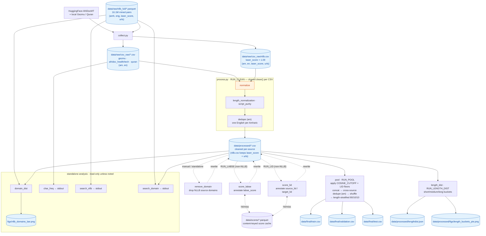

# Pipeline dataflow

End-to-end dataflow for the Amharic–English corpus build. Run the whole thing
with `python process.py` (toggles + config at the top of that file).

Length buckets (`length_dist`) and the stratified split (`pool`) both read their
cutoffs from `nmt/lengths.py`, so the reported distribution and the split match.

## Notes

- **`collect.py` gathers everything into `csv_raw/`.** HuggingFace AfriDocMT +
  local Gezmu/Quran, plus the NLLB parquet laser-filtered down to `csv_raw/nllb.csv`
  (16.1M → ~425k; the LASER margin score plus per-sentence `source_lid`/`target_lid`
  LID confidences ship with the data and are immutable, so filtering them up front is
  a cheap, lossless reduction — the filter keeps `laser_score`, `source_lid`, and
  `target_lid` all above their cutoffs). `nllb.csv` is standardized to `am/en` but
  keeps `laser_score` + LID + url columns.
- **Collection is per-source and incremental.** The ~2.3GB NLLB parquet is downloaded
  only when absent, so a `LASER_CUTOFF` change re-reads it locally (`scan_parquet`,
  cutoffs pushed into the scan) and never re-downloads. AfriDoc/Gezmu/Quran have fixed
  inputs, so a default run skips them once their CSVs exist — which also avoids
  `load_dataset`'s HuggingFace round-trip on every call. Tuning the NLLB cutoff is
  therefore `python -m collection.collect nllb`: ~3s, no network. A named source always
  rebuilds; `--force` rebuilds everything.
- **`process.py` cleans every `csv_raw/*.csv` uniformly** through one shared
  `clean()` (normalize → length → script_purity → dedupe-on-`am`), so the whole
  corpus — including NLLB — is normalized identically.
- **`pool`** applies the quality cutoffs (`COSINE_CUTOFF`, the two LID floors — each
  on the sources that carry that score column), concatenates, dedups on `am` (one
  English per Amharic sentence), then splits 80/10/10 **stratified by Amharic length
  bucket**, so every split carries the same short/medium/long proportions. Each `am`
  is unique after dedup, so no Amharic sentence leaks across train/val/test.
- **`score_labse`** and **`score_lid`** are optional in-place passes (dashed) that
  only *annotate* the non-NLLB CSVs — `labse_score` from LaBSE cosine, and
  `source_lid`/`target_lid` from the *same* fastText model (Meta's lid218e) NLLB
  scored its own pairs with, so a non-NLLB row carries LID confidences directly
  comparable to an NLLB row. Neither drops a row; the cutoffs live at the pool stage.
- **Scoring is separate from filtering, on purpose.** The models cost hours; a cutoff
  costs a comparison. Every score is cached in `data/scores/*.parquet` keyed by a
  hash of the sentence pair, so it survives a re-clean and is shared across sources.
  Retuning a threshold is a re-pool, not a re-embed, and *lowering* one recovers rows
  rather than losing them permanently. Delete a cache file to force a re-score — do
  this after changing a model or `processing/clean/normalize.py`, since the keys are
  hashes of normalized text.
- **`remove_domain`** is a standalone manual tool (not a `process.py` stage) that
  prunes NLLB source domains from `data/processed/nllb.csv` in place.
