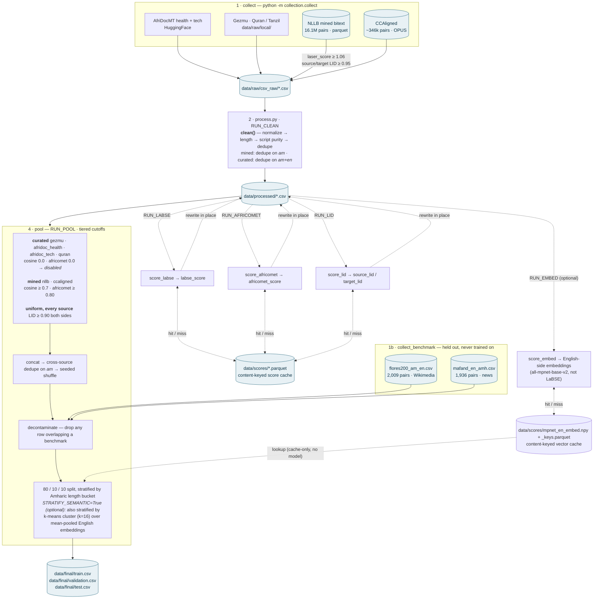
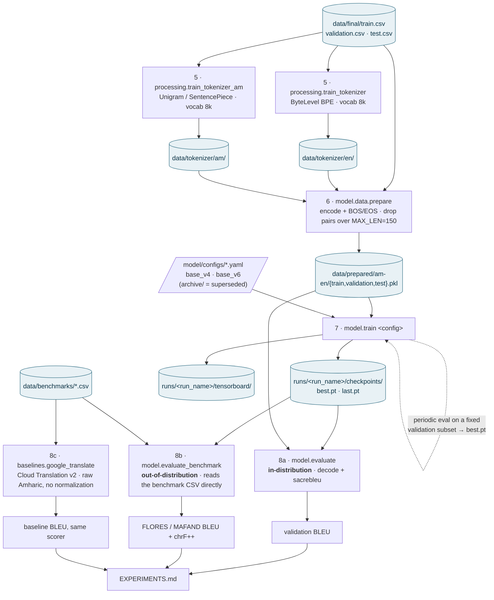

# Pipeline dataflow

End-to-end dataflow, raw sources → trained checkpoint → BLEU. Two diagrams: the
**corpus build** (collect → process → pool → `data/final/`) and the **model track**
(tokenizers → prepare → train → evaluate).

Experiment results and per-run history live in [EXPERIMENTS.md](EXPERIMENTS.md);
this file is only about *what flows where*.

---

## A. Corpus build

Everything here is driven by two entry points: `python -m collection.collect`
(acquire) and `python -m processing.process` (clean → score → pool → split).

**The one thing to remember about this half:** scoring and filtering are
deliberately separate. `score_*` only *annotates* `data/processed/` and caches
every score in `data/scores/` keyed by a hash of the sentence pair. The cutoffs
are applied at the **pool** stage. So retuning a threshold is a re-pool (seconds),
not a re-embed (hours), and *lowering* a cutoff brings rows back rather than
losing them permanently.

**Live cutoff values** are the ones in `processing/process.py`'s CONFIG block —
`process.py` passes them into `pool.main()`, so the module-level constants in
`processing/utils/pool.py` are only defaults for a standalone call.

**Why the tiering exists:** the curated sources are professionally human-translated.
Applying a QE/alignment cutoff tuned for noisy mined bitext to them gutted Gezmu to
13,638 of 124,409 pairs and Quran to 446 of 37,380. See EXPERIMENTS.md → "Root-cause
check against Gezmu et al."

---

## B. Model track

`data/final/` is the handoff point. Everything below is one-off artifact building
plus per-run training; none of it is a `process.py` stage.

**Why `evaluate_benchmark` is a separate entry point** rather than another split
of `model.evaluate` — all three reasons matter for the numbers being publishable:

1. `model.evaluate` reads `data/prepared/*.pkl`, which would mean routing a
   benchmark through `data/final/` — the one directory that must only ever hold
   training data.
2. Both `prepare.py` (`MAX_LEN`) and `TranslationDataset` (`max_src_len`) *silently
   drop* over-length pairs. Dropping rows from a fixed benchmark changes what
   "FLORES devtest" means. `evaluate_benchmark` truncates instead — count in equals
   count out.
3. `model.evaluate` rebuilds references by decoding target ids back to text, a lossy
   tokenizer round-trip. A benchmark reference is scored exactly as it ships.

The Amharic **source** *is* normalized in `evaluate_benchmark` (it's the distribution
the model trained on); the English **reference** is never touched. `google_translate`
deliberately gets *raw* Amharic — normalizing for a black-box system would handicap it.

---

## Cheat sheet

| I want to… | Run |
|---|---|
| Re-tune a quality cutoff | Edit `processing/process.py` CONFIG, `python -m processing.process` (scores come from cache; only pool re-runs) |
| A/B semantic stratification | Flip `STRATIFY_SEMANTIC` in `processing/process.py` CONFIG (needs `RUN_EMBED=True` at least once first) |
| Re-tune the NLLB LASER cutoff | `python -m collection.collect nllb` (~3s, no network), then `python -m processing.process` |
| Force a re-score | Delete the relevant `data/scores/*.parquet` — required after changing a model or `clean/normalize.py`, since keys are hashes of normalized text |
| Add a new source | Drop a CSV in `data/raw/csv_raw/`; `process.py` globs the directory |
| Change vocab size | Edit `VOCAB_SIZE` in both tokenizer scripts, retrain both, **re-run `model.data.prepare`**, and train fresh (checkpoints become shape-incompatible) |
| Train a new run | `python -m model.train model/configs/<cfg>.yaml` |
| Score in-distribution | `python -m model.evaluate <cfg> <ckpt> validation` |
| Score OOD | `python -m model.evaluate_benchmark <cfg> <ckpt> data/benchmarks/flores200_am_en.csv devtest` |

## Invariants worth not breaking

- `data/final/` holds **training data only**. Benchmarks live in `data/benchmarks/`
  and reach the corpus build only via `decontaminate`, which *removes* rows.
- `model.max_len` (config) **≥** `MAX_LEN` (`prepare.py`) — the positional-encoding
  table has to index the longest sequence that survives.
- Tokenizer vocab size is baked into every checkpoint. Changing it invalidates all
  of them.
- Cross-source dedupe on `am` happens *before* the split, so no Amharic sentence
  leaks across train/val/test.
- Length buckets come from `processing/dist/lengths.py` — one source of truth shared
  by the length report and the stratified split.
- Semantic stratification (`STRATIFY_SEMANTIC=True`) clusters the *English* side but
  still groups by `am` for leak prevention — `processing.utils.pool.am_cluster_ids`
  mean-pools every English reference sharing an `am` into one vector first, so a
  multi-reference `am` (e.g. Quran verses) can't land in different clusters and
  defeat the grouping.
